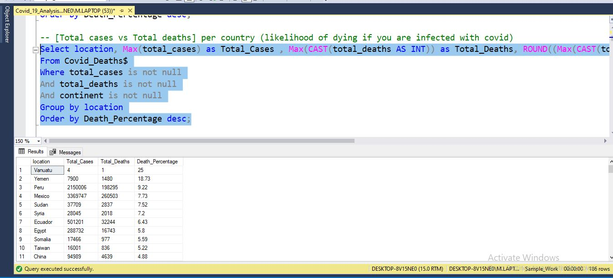
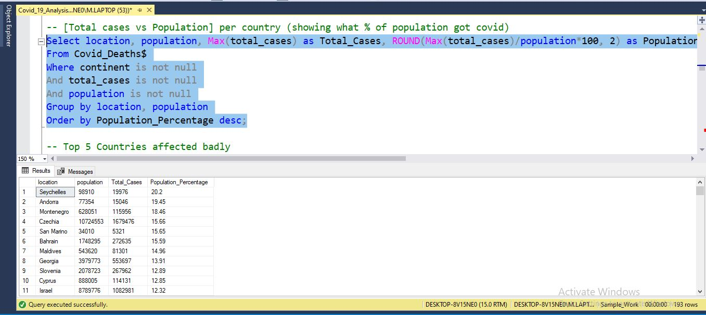
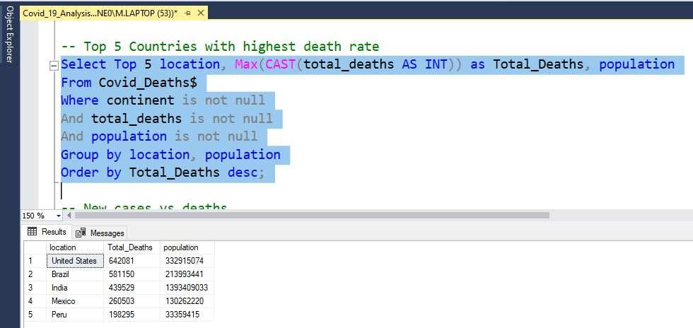
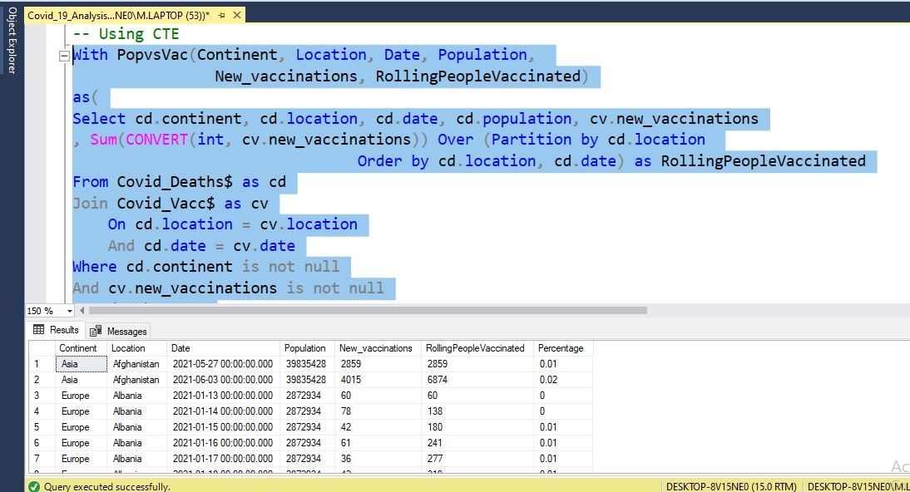
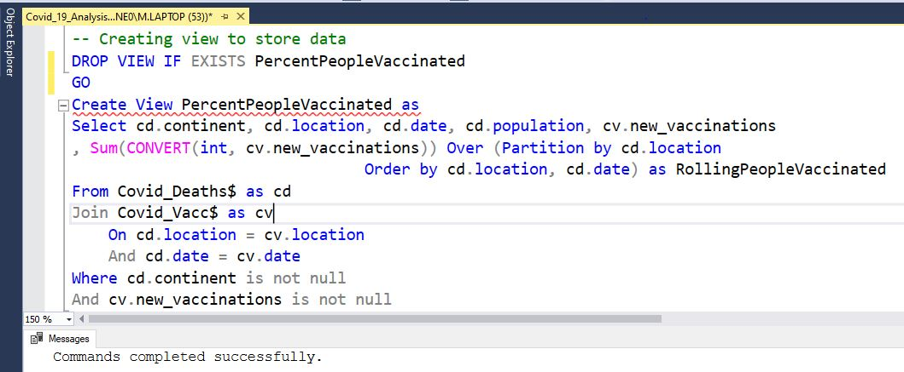

# **Exploratory Data Analysis of Covid 19 using SQL**

Software: Sql Server Management Studio  
Database: MS SQL SERVER  
Programming Language: SQL  
  
In this project, Covid 19 dataset is analyzed to get the insights regrading total cases, total deaths, and vaccinations by countries and worldwide. In this SQL Analysis Sum, Max, GroupBy, OrderBy, Joins, Window Functions/CTE, Views and Temp Tables are used/created.  

Some of the insights are:

## [Total cases vs Total deaths] per country (likelihood of dying if you are infected with covid)

## [Total cases vs Population] per country (showing what % of population got covid)

## Top 5 Countries with highest death rate  

## Percentage of people vaccinated per country using CTE (Rolling Count Countrywise)

## Created view to store PercentPopulationVaccinated data
  

If you have any query, please reach out to me on LinkedIn.  
LinkedIn: https://www.linkedin.com/in/zohaib-sheraz-mughal-08b972163/
